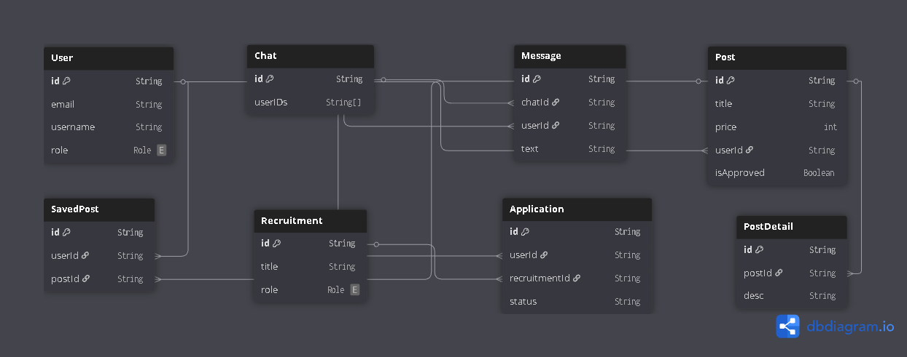

# EstateEdge

**EstateEdge** is a full-stack real estate web application that enables users, agents, and admins to interact in a dynamic property marketplace. Built using the **MERN stack**, **Prisma ORM**, and styled with **SCSS**, the platform supports property listings, live chat, agent recruitment, real-time admin dashboards, and more.

🌐 **Live Demo:** [https://estateedge-tfzd.onrender.com](https://estateedge-tfzd.onrender.com)

---

## 👥 Team Members

<div align="center">

| Name                    | ID               | Role                                    |
|-------------------------|------------------|-----------------------------------------|
| Srabonti Suchi Talukdar | 0562220005101037 | Frontend & Backend Developer, Team Lead |
| Allo Rani Malakar       | 0562220005101013 | UI/UX Designer, SCSS & Styling          |
| Rashada Chowdhury       | 0562220005101055 | Backend Support, Testing & Debugging    |

</div>

---

## Project Features

### User Roles and Authentication

- Implementation of three distinct user roles: Customer, Agent, and Administrator.
- Secure authentication using JSON Web Tokens (JWT) with role-based access control.
- Users have personalized dashboards and profiles with update capabilities.

### Property Management

- Agents can create, edit, and manage property listings.
- Property listings require administrative approval prior to publication.
- Customers can browse, filter, and save properties to their profiles.
- Listings provide comprehensive details including amenities, location coordinates, utilities, and pet policies.
- Images are uploaded via Multer, securely stored in the server's file system, and dynamically linked with user profiles and listings.

### Responsive Design and Accessibility

- The application is fully responsive across desktop, tablet, and mobile devices using SCSS media queries and modular layout structures.
- Accessibility considerations include semantic HTML, alt text for images, and color contrast for better UX.

### Communication System

- Integrated real-time chat functionality enabling:
  - Direct messaging between customers and agents.
  - Live chat support with administrators via Crisp AI chatbot integration.
- **Email communication** system for contacting site administrators:
  - Emails sent via frontend using **EmailJS** (without exposing backend credentials).
  - Automated responses confirming receipt.

### Recruitment and Career Module

- Dynamic recruitment posts for agent and administrator positions.
- Application submission with relevant documentation including CVs and portfolios.
- Administrative review and management of applicant status (approve/reject/promote).

### Administrative Dashboard and Controls

- Real-time data visualization with charts and metrics for:
  - Total number of users and agents.
  - Property listings including pending approvals.
  - Geographic distribution and pricing trends of properties.
- Full administrative control over users, properties, and recruitment posts.
- Ability to deactivate/reactivate agent accounts and modify user roles.
- Utilized **Recharts** library (including BarChart, PieChart, and more) to display dynamic charts for user statistics, pricing trends, and property distributions.

---

## Technologies and Tools

- **Frontend:** React.js with Vite, SCSS for responsive and modular styling (compiled to CSS).
- **Backend:** Node.js with Express.js framework.
- **Database:** MongoDB managed through Prisma ORM.
- **Authentication:** JWT for secure session management.
- **File Uploads:** Multer middleware for handling image uploads securely and efficiently.
- **State Management:** React Context API for managing authentication and user session state across the app.
- **Data Visualization:** Used **Recharts** for creating responsive and interactive bar charts, pie charts, and other visual components in the admin dashboard.
- **AI Integration:** Crisp Chat for AI-powered live customer support.
- **Email Integration:** EmailJS for sending emails directly from the frontend contact form.
- **Deployment:** Hosted on Render platform for live production.

---

## Testing & Debugging

- Used browser Developer Tools and console logging for frontend issue tracking.
- API endpoints were tested and validated using **Postman** & **Thunder Client**.
- Applied manual form testing and behavior validation across roles.

---

## Installation Instructions

### 1. Clone the repository

To get started, first clone the repository to your local machine:

```bash
git clone https://github.com/srabonti03/EstateEdge.git
```

### 2. Set up Environment Variables

Navigate to the backend folder and create a .env file. In the .env file, add the following:

```bash
PORT=<your preferred port number>
DATABASE_URL=<your MongoDB URI here>
MAIL_USER=<your email address>
MAIL_PASS=<your email app password>
NODE_ENV=development
JWT_SECRET_KEY=<your secret key>
```

Just replace each placeholder with your actual values when you configure your environment.

### 3. Install Dependencies

#### Backend:

Navigate to the api directory and install the required dependencies:

```bash
cd api
npm install
```

#### Frontend:

Navigate to the client directory and install the required dependencies:

```bash
cd client
npm install
```

---

## Run the Application

### 1. Database Setup:

```bash
cd api
npx prisma generate
npx prisma db push
```

### 2. Backend:

```bash
cd api
npm start
```

### 3. Frontend:

```bash
cd client
npm run dev
```

---

## View the Project

Once both servers are running, you can view the project by opening the following URL in your browser:

**Local:** [`http://localhost:5173/`](http://localhost:5173/)

You can expose it to your network using --host or press h + Enter to show help in the terminal.

---

## Project Folder Structure

```bash
EstateEdge/
├── api/                        # Backend API server
│   ├── controllers/            # Route handlers for API endpoints
│   ├── lib/                    # Utilities: mail, prisma client, recruitment logic
│   ├── middleware/             # JWT auth, multer, other middleware
│   ├── prisma/                 # Prisma schema and migrations
│   │   └── schema.prisma       # Prisma schema file
│   ├── routes/                 # API route definitions
│   └── app.js                  # Express server setup
│
├── client/                     # React frontend application
│   ├── src/
│   │   ├── components/         # Reusable UI components
│   │   ├── context/            # React context for current user info
│   │   ├── lib/                # Dummy data and utilities
│   │   ├── routes/             # Main page routes
│   │   └── app.js              # Frontend root component and routing
│
├── public/                     # Static assets for the project
│   ├── admins/                 # Admin profile avatars
│   ├── agents/                 # Agent profile avatars
│   ├── users/                  # User profile avatars
│   └── posts/                  # Property listing images
│
├── .gitignore                  # Git ignore rules for Node.js and others
├── LICENSE                     # Apache License 2.0 file
└── README.md                   # Project documentation and instructions
```

---

## Database Export

You can find the Prisma schema file here:

- [`EstateEdge/api/prisma/schema.prisma`](./api/prisma/schema.prisma)

> To apply the schema to your database, use:  
> `npx prisma db push`

---

## Entity Relationship Diagram (ERD)

Below is the ERD representing the core data structure of the EstateEdge platform:

<p align="center">
  
</p>

> This diagram illustrates key entities like `User`, `Post`, `Application`, `Recruitment`, and how they interrelate.

---

## Development Methodology

We used the **Rapid Application Development (RAD)** model to:

- Rapidly prototype core modules
- Iterate on features through feedback
- Prioritize team-based modular development

---

##  Security Measures

- **JWT-based authentication**
- Role-based access control (Customer, Agent, Admin)
- Passwords securely hashed using bcrypt
- Input validation and protection against unauthorized API access

## Submission Deliverables

- Complete source code hosted on GitHub repository.
- Database export files for MongoDB.
- Comprehensive README.md documentation.
- Project documentation in PDF format.
- Presentation slides in PDF/PPT format.

---

## System Requirements for Demonstration

- Node.js (version 18 or higher)
- MongoDB Atlas or local MongoDB instance
- Modern web browser (Google Chrome or Firefox)
- Laptop with the project set up and ready to run

---

## Contact and Support

For further inquiries or support, please reach out via email:

**Email:** [srabonti.talukdar2003@gmail.com](mailto:srabonti.talukdar2003@gmail.com)

Alternatively, you can submit issues or feature requests through the GitHub repository:

[GitHub Issues](https://github.com/srabonti03/EstateEdge/issues)

Automated responses acknowledge receipt of messages and promise follow-up within three business days.

---

## Contribution Guidelines

Feel free to fork this repository, open issues, and submit pull requests. All contributions are welcome!

## License

This project is licensed under the [Apache License 2.0](https://www.apache.org/licenses/LICENSE-2.0).  
Please see the [LICENSE](LICENSE) file for more details.
